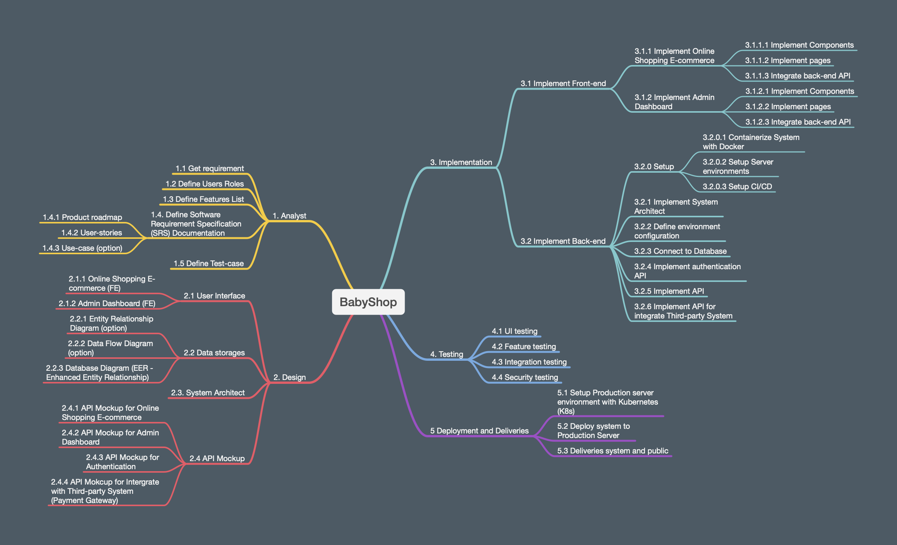

# Phase 01 - Get requirement

## Purpose

- Define requirement of project. 
- Define goal of project.
- Define software process.

## List of Phase

Team use SCRUM process for this project.
The project board: https://github.com/users/ngdhuy/projects/4

## Define requirement

We want to develop the e-commerce system for selling baby toy such car, toy, teddy-bear... The system have the function:

* List of items in the system. 
* Show detail information of items.
* User can register their information to join the membership program. 
* User can chose and buy the items.
* User can search for specific items.
* Admin can manage the items's information.
* Admin can manage the orders of user. 
* Admin can manage the user information.
* Admin can manage the information for the membership program such create and manage voucher-code.
* Admin can create the report for selling and information of items.

That's all for the basic requirement. 

After that, the team can brain storm to define advance feature such as connect to payment gateway, notification for admin when user create the order, ...
