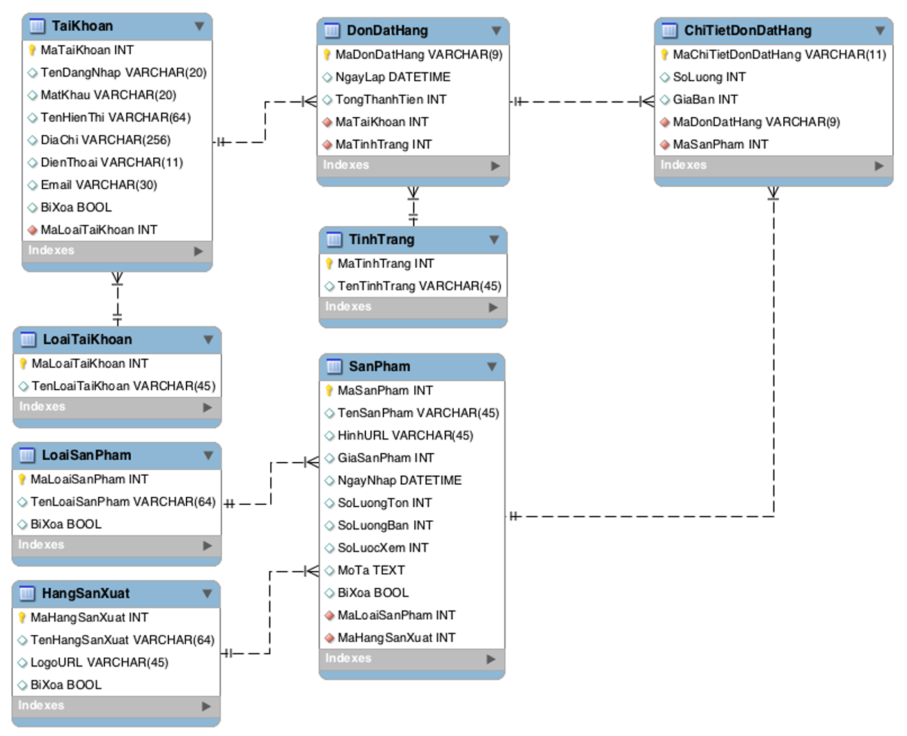

# Database Design

## 1 - Database Diagram

## 2 - Database specification

### 2.1 - List of Tables

| No     | Table name            | Description                               |
| :----: | :-------------------- | :---------------------------------------- |
| 1      | loaitaikhoan          | Thông tin phần quyền của tài khoản        |
| 2      | taikhoan              | Thông tin tài khoản                       |
| 3      | hangsanxuat           | Thông tin hãng sản xuất                   |
| 4      | loaisanpham           | Thông tin danh mục sản phẩm               |
| 5      | sanpham               | Thông tin sản phẩm                        |
| 6      | tinhtrang             | Thông tin tình trạng của đơn đặt hàng     |
| 7      | dondathang            | Thông tin đơn đặt hàng                    |
| 8      | chitietdondathang     | Thông tin chi tiết đơn đặt hàng           |

### 2.2 - Table structure

2.2.1 - Table: ***loaitainkhoan***

| No     | Field name            | Data type     | Key (PK/FK)  | Description                               |
| :----: | :-------------------- | :-----------: | :----------: | :---------------------------------------- |
| 1      | maloaitaikhoan        | int           | PK           | mã loại tài khoản                         |
| 2      | tenloaitaikhoan       | varchar(45)   |              | tên loại tài khoản                        |

2.2.2 - Table: ***taikhoan***

| No     | Field name            | Data type     | Key (PK/FK)  | Description                               |
| :----: | :-------------------- | :-----------: | :----------: | :---------------------------------------- |

2.2.3 - Table: ***hangsanxuat***

| No     | Field name            | Data type     | Key (PK/FK)  | Description                               |
| :----: | :-------------------- | :-----------: | :----------: | :---------------------------------------- |

2.2.4 - Table: ***loaisanpham***

| No     | Field name            | Data type     | Key (PK/FK)  | Description                               |
| :----: | :-------------------- | :-----------: | :----------: | :---------------------------------------- |

2.2.5 - Table: ***sanpham***

| No     | Field name            | Data type     | Key (PK/FK)  | Description                               |
| :----: | :-------------------- | :-----------: | :----------: | :---------------------------------------- |

2.2.6 - Table: ***tinhtrang***

| No     | Field name            | Data type     | Key (PK/FK)  | Description                               |
| :----: | :-------------------- | :-----------: | :----------: | :---------------------------------------- |

2.2.7 - Table: ***dondathang***

| No     | Field name            | Data type     | Key (PK/FK)  | Description                               |
| :----: | :-------------------- | :-----------: | :----------: | :---------------------------------------- |

2.2.8 - Table: ***chitietdondathang***

| No     | Field name            | Data type     | Key (PK/FK)  | Description                               |
| :----: | :-------------------- | :-----------: | :----------: | :---------------------------------------- |