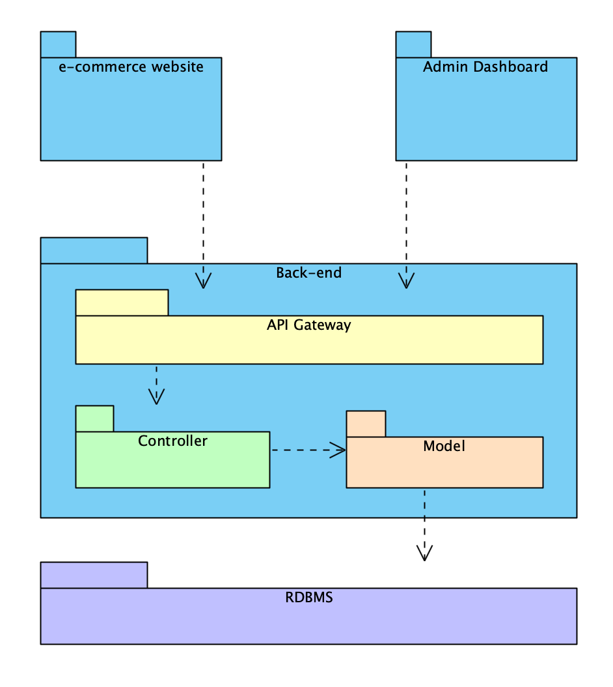

# Software Architecture Design

## 1 - Architecture Diagram

## 2 - Architecture description

* ***e-commerce website*** is frontend for customer can buy the product. It is built by ReactJS. 
* ***admin dashboard*** is frontend for the Admin and Employee can manage system. It is built by ReactJS.
* ***Backend*** is the backend system to access database and manage business logic for the system.
    * ***API Gateway*** manage the request from frontend and direct to controller which process the logic. 
    * ***controller*** is process the logic of business. 
    * ***model*** manage the object which is loaded and access data from database.
* ***RDBMS*** is Relationship Database Management System